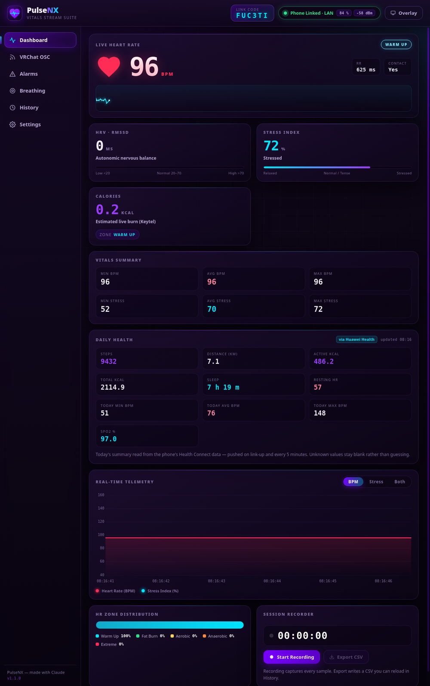

# PulseNX 💜 — Vitals Stream Suite

**PulseNX** streams your real-time heart rate and HRV from a smartwatch to your PC and pipes it
into a live dashboard, desktop/OBS overlays, Discord Rich Presence, and **VRChat OSC** avatar
parameters. It is the NX-branded successor to PulseLink Bridge — same feature set, rebuilt clean.

*PulseNX — made with Claude.*



## How it flows

```
Watch (BLE HR broadcast) ──▶ Phone (PulseNX Bridge, foreground service)
                                   │
                     ┌─────────────┴──────────────┐
                LAN mode                      Cloud mode
        ws://<pc>:9000 (+UDP 9001          MQTT over WSS via
         auto-discovery beacon)            broker.emqx.io, topic
                     │                     pulsenx/vitals/pc-<CODE>
                     └─────────────┬──────────────┘
                                   ▼
                       PulseNX PC app (Electron)
        dashboard • VRChat OSC • overlay • OBS :9005 • Discord RPC
```

## Features

- **VRChat OSC**: full avatar parameter set at 1 Hz (`HR`, `HRPercent`, `onesHR/tensHR/hundredsHR`,
  HRtoVRChat_OSC + VRCOSC compatible), true-frequency beat pulse, chatbox streaming, HR warning flag.
- **Dashboard**: live BPM/HRV (rMSSD), stress index, training zones + distribution, min/max/avg,
  calories, live timeline chart, session recorder with CSV export and history review.
- **Daily Health card**: your day so far — steps, distance, active/total calories, sleep, resting
  HR, today's min/avg/max BPM and SpO2 — read on the phone from **Huawei Health via Health
  Connect** and pushed to the PC every 5 minutes. Unknown values stay blank instead of guessing.
- **Overlays**: frameless always-on-top desktop widget + OBS browser source (`http://localhost:9005`).
- **Breathing pacer**: 6 breaths/min resonance guide with chimes and coherence flow score.
- **Alarms**: high-HR tone and custom threshold alarms (audio + OSC).
- **Discord Rich Presence** with live vitals templates.
- **Phone app**: heart rate from the watch over BLE *or* straight from Health Connect, optional
  **Google Fit sync** (Huawei records mirrored under the PulseNX origin so any Health Connect
  reader picks them up), and a Liquid Glass UI over an animated aurora background.

## Privacy

Cloud mode publishes vitals to a **public MQTT test broker** (`broker.emqx.io`) under a random
6-character session code. That is obscurity, not security — anyone who obtains the code can read
the stream. For anything sensitive use **LAN mode**, which never leaves your network. Codes are
regenerated on every PC-app launch.

## Building

### PC app (AppImage + Windows portable exe)
```bash
cd pc-app
npm install
npm start          # run from source
npm run dist:linux # -> dist/PulseNX.AppImage
npm run dist:win   # -> dist/PulseNX.exe (needs wine on Linux)
```

### Android bridge APK
```bash
cd android-app
./gradlew assembleRelease   # -> app/build/outputs/apk/release/app-release.apk
```
Prebuilt APKs are attached to each [release](https://github.com/nerdrx/pulsenx/releases).
Requires a JDK 17+ and an Android SDK with platform 34; `local.properties` points at the SDK.

## Setup

1. **Watch**: enable HR broadcasting (Huawei: Settings → HR Data Broadcasts; Galaxy Watch:
   Samsung Health → Share HR with gym equipment; Pixel: Fitbit Exercise → Bluetooth HR + workout).
2. **PC**: launch PulseNX, note the 6-character **link code** in the header.
3. **Phone**: install the PulseNX Bridge APK, enter the link code (cloud) or PC IP (LAN — usually
   auto-discovered), tap **Link PC**, then **Scan & Link Watch**. Vitals start streaming.
4. **Health data** (optional): grant the phone app its Health Connect permissions to fill the
   Daily Health card, and switch the HR source to *Health Connect* if you would rather read
   Huawei Health than pair a BLE watch.
